<!--
theme: uncover
class: invert
paginate: true
_paginate: false
-->

<!-- _footer: "Hour of Code 2025 🤝 SNCF Connect & Tech 🤝 Ecole Sacré Coeur La Bruffière" -->

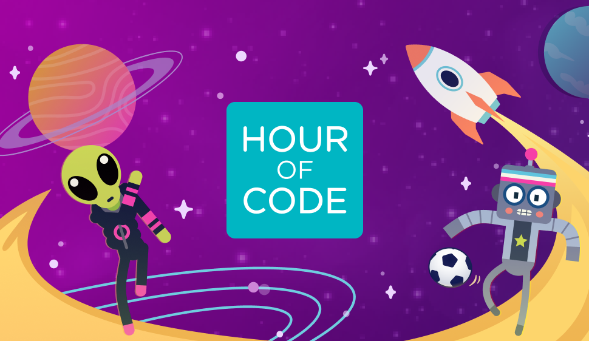

---

<!-- _footer: "Hour of Code 2025 🤝 SNCF Connect & Tech 🤝 Ecole Sacré Coeur La Bruffière" -->

### Apprendre à
## programmer
#### en s'amusant

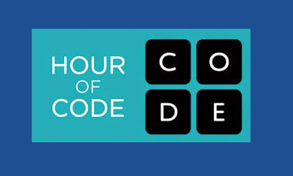

---

### Qui suis-je ?

  - Mickaël
  - découverte d'un ordinateur à 3 ans
  - travaille dans l'informatique depuis 17 ans

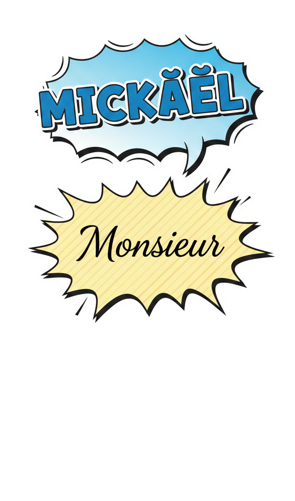

---

### Qui suis-je ?

  - Mickaël
  - découverte d'un ordinateur à 3 ans
  - travaille dans l'informatique depuis 17 ans

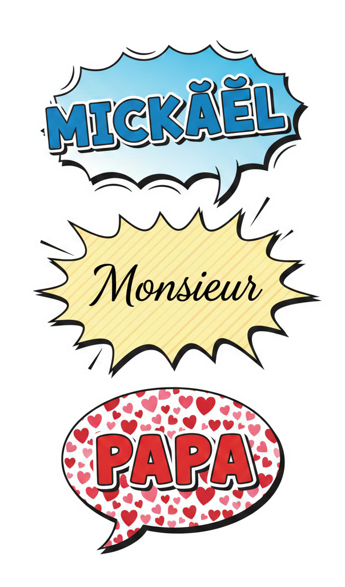

----

Nantes, Paris et Lille

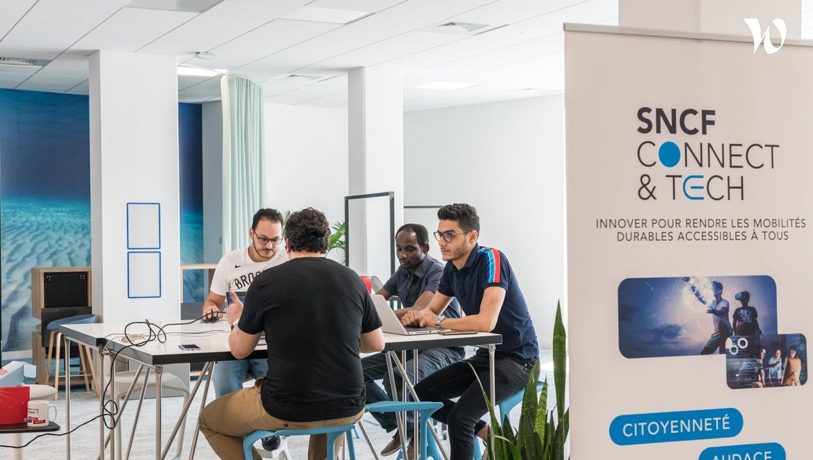

----

L'application et le site web pour acheter des billets de train en France

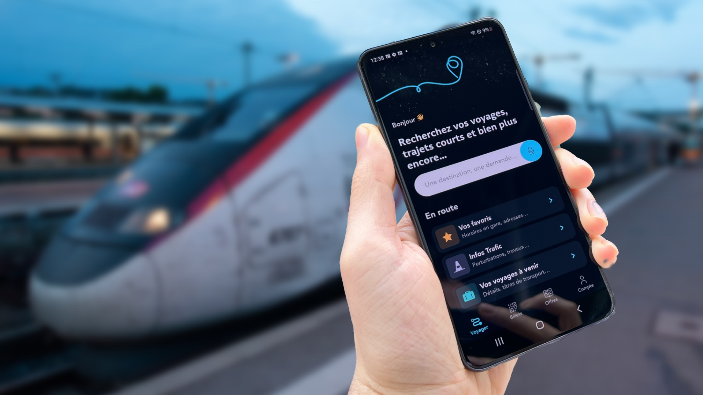

---

## La programmation

- A quoi ça sert ?
- Qui peut en faire ?

----

----

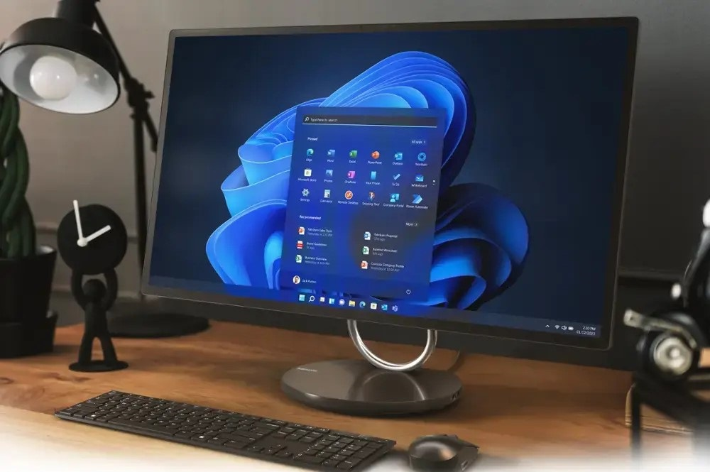

----

----

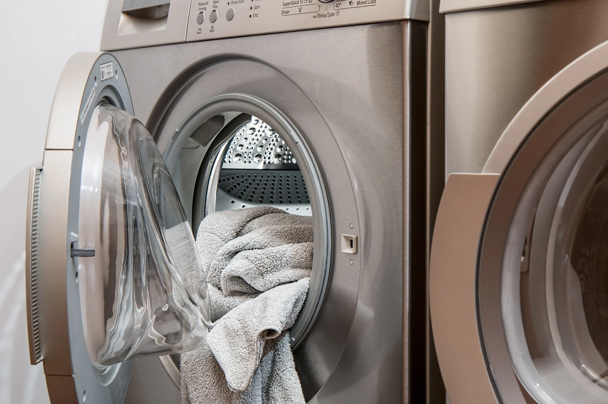

----

----

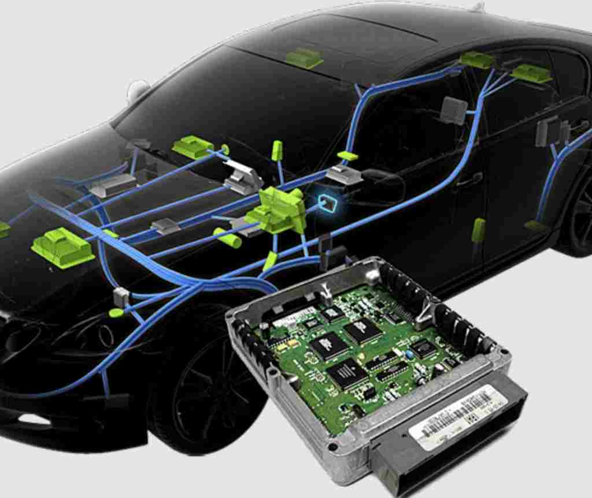

----

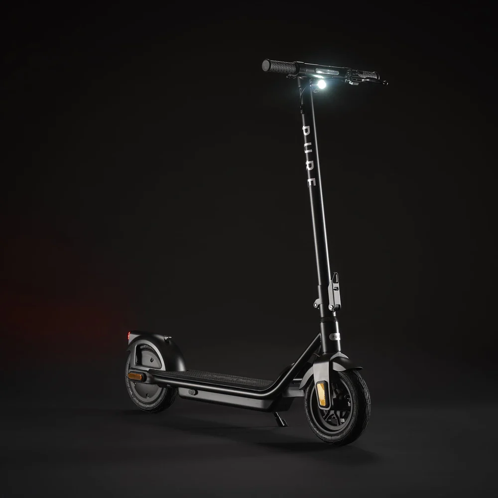

----

# Le point commun ?

* Circuit électronique

----

### On trouve de la programmation
## partout !

  - jouets électroniques
  - jeux vidéos
  - fusées
  - imagerie médicale (radio, scanner, IRM, ...)
  - musique
  - effets spéciaux dans les films

----

Programmation = des listes d'instructions
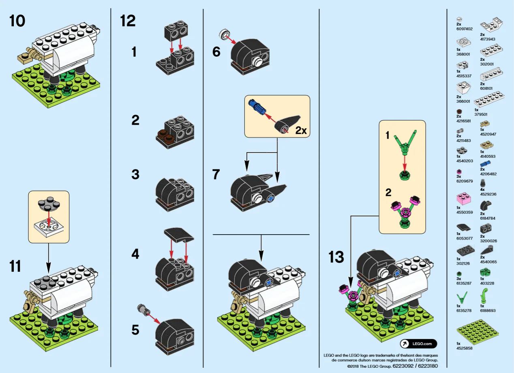

---

# 🤔 Qui

## peut programmer ? 👩‍💻👨‍💻

----

Tout le monde !

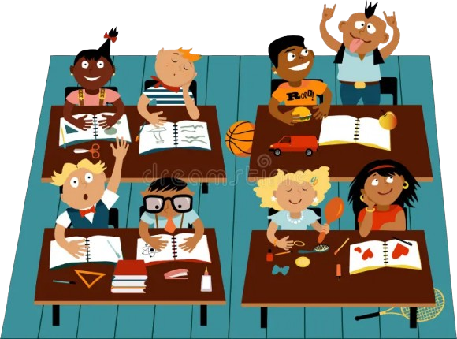

----

et pourtant ...

... **peu de filles** en font leur **métier** ...

... mais celles qui **découvrent** la **programmation** en **primaire** ou au **collège** ont **10x** plus de **chances** de faire des **études supérieures** dans ce domaine.

---

